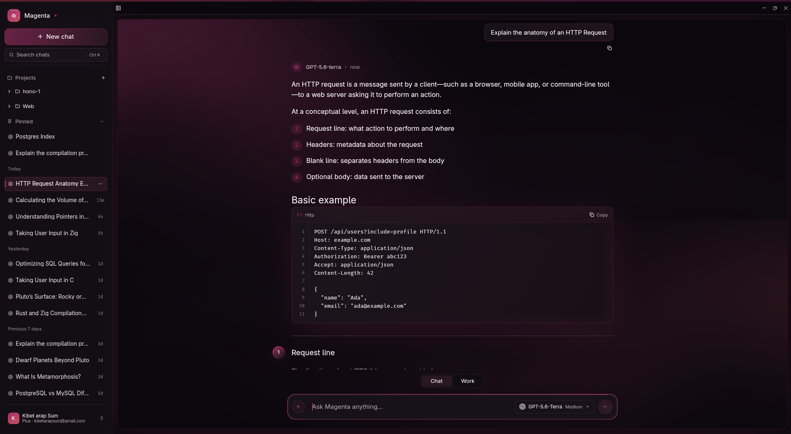
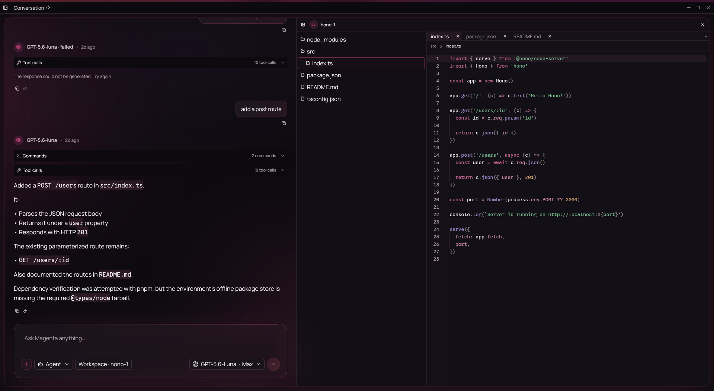

# Magenta

Magenta is an experimental native AI chat and workspace client written in Rust
with GPUI through [GPUI Kit](https://github.com/longbridge/gpui-kit). The workspace
currently pins `gpui-kit` to `0.6.1`.



It combines streaming conversations, local history, a Git-aware Changes panel,
and an approval-controlled workspace agent in a native desktop window. Linux is
the platform exercised by this repository. The production provider is OpenAI
through ChatGPT browser sign-in; provider icons in the UI do not imply
additional integrations.

## Start here

Use Rust **1.98.0**, the version used by [CI](.github/workflows/ci.yml), and install
the native Linux dependencies in the [development guide](docs/development.md).
Then run from the repository root:

```bash
cargo run --locked
```

Connect your ChatGPT account from the sidebar account menu or Settings. Choose a
model and its supported effort level in the composer. **Chat** provides a compact
conversation input; **Work** expands the composer with workspace, Files, and
Changes controls while preserving a separate draft. For Work mode, add a project
or choose a workspace directory first. Commands require Bubblewrap and a
successful isolation probe; file tools remain available without it.

## Current features

- Streaming chat with cancellation, Markdown, syntax-highlighted code, inline
  code, copy actions, and inline/display math rendered with RaTeX.
- Up to four local image attachments per Chat message, with validation and
  managed copies so moving the original file does not break history.
- SQLite history with pins, rename, confirmed deletion, generated titles,
  full-text search, and navigation to matched messages. Pages contain up to
  50 messages; the conversation view retains at most 150 rendered messages.
- Model-aware context budgeting that selects recent whole turns independently
  of the visible page and indicates when older context was omitted.
- Distinct Chat and Work composers with independent drafts, a unified model and
  effort picker, and workspace controls that appear only for agentic work.
- Registered projects, project conversations, and a read-only code workbench
  with a collapsible explorer, independent file tabs, breadcrumbs, search, and
  folding. Switching conversations closes and clears the workbench session.
- File and unified-diff view modes for agent changes, change status, hunk
  navigation, and a per-tab view selection. Diff review is read-only; approvals
  remain in the conversation.
- A Git-aware Changes panel with repository status, staged and unstaged groups,
  file diffs, per-file and bulk stage/unstage actions, and confirmed commits.
- Workspace listing, literal text search, bounded reads, file creation, and
  patch previews. Ordinary file edits can be approved individually or for the
  current run; protected reads and commands still need individual approval.
- Sandboxed, non-interactive commands with streaming output, timeouts, and
  explicit exit/failure states. Commands and tool sections open for active work
  and otherwise collapse automatically unless manually overridden.
- Persistent, categorized response failures with relevant recovery actions,
  preserved partial output, and copyable, allowlisted diagnostic details.
- Provider-advertised `/plan`, `/review`, and `/explain` commands with a
  searchable, keyboard-accessible palette, one-turn command persistence, and
  read-only Work tools for planning and review.
- Warm light/dark themes, a layered dark surface system, a subtle animated fluid
  field, and separate UI, code, and math typography preferences in a TOML-backed
  settings window.

The full-height sidebar remains separate from the main panel: **the titlebar
must not extend over the sidebar**. This layout rule applies to future UI work
as well as the current design.

Agent mode pairs the conversation with a workspace-aware code workbench, keeping
tool activity, approvals, files, and diffs in one focused view.



## Documentation and crate ownership

Each crate has a guide to its responsibilities, public API, source layout, and
verification commands. The package names below are also the names accepted by
`cargo -p`.

| Crate | Responsibility | Direct internal runtime dependencies |
| --- | --- | --- |
| [magenta-core](crates/core/README.md) | Domain values, ports, stream contracts, context budgeting | None |
| [magenta-application](crates/application/README.md) | Sending, regeneration, retry, agent orchestration, history and project workflows | core |
| [magenta-providers](crates/providers/README.md) | OpenAI authentication, model discovery, streaming; deterministic demo provider | core |
| [magenta-storage](crates/storage/README.md) | SQLite history/projects, migrations, attachments, TOML settings | core |
| [magenta-workspace](crates/workspace/README.md) | Workspace file access, repository status/diffs/staging/commits, Bubblewrap commands | core |
| [magenta-ui](crates/ui/README.md) | GPUI conversations, Chat/Work composers, workbench, Changes panel, themes and settings | application, core |
| [magenta-desktop](crates/desktop/README.md) | `magenta` executable, adapter wiring, assets, windows and diagnostics | All six library crates |

See also the [development guide](docs/development.md) and
[error-handling guide](docs/error-handling.md). Generate the API reference with:

```bash
cargo doc --workspace --locked --all-features --no-deps
```

Cargo's default workspace member is `magenta-desktop`. Use `--workspace` when
you intend to document or test every crate; `--all-targets` alone does not select
all workspace packages.

## How a conversation runs

The desktop crate constructs concrete providers and stores and injects their
core traits into the application and UI. Core does not depend on GPUI, HTTP, or
SQLite. Application code uses ports rather than concrete adapters.

1. A workflow validates the request and asks storage to prepare a durable turn.
2. Storage selects budgeted context and commits the user message and a streaming
   assistant placeholder before provider work starts.
3. The UI consumes the returned stream, batches visual updates, and owns its
   cancellation lifetime. Agent runs additionally process tools and approvals.
4. Completion, cancellation, or failure saves the terminal message. Agent
   activity is recorded separately; individual text deltas do not write to SQLite.

Retry appends a new assistant attempt while retaining the failed response and
excluding its partial text from request context. Regeneration replaces the
addressed assistant response. Preparing an agent continuation puts a draft in
the composer for review; it does not resume or replay tools automatically.

## Local data and settings

| Data | Location |
| --- | --- |
| Conversations, projects, agent activity | `<platform-local-data>/magenta/conversations.sqlite3` |
| Managed image copies | `<platform-local-data>/magenta/attachments/` |
| Daily rotating logs | `<platform-local-data>/magenta/logs/` |
| User preferences | `<platform-config>/magenta/settings.toml` |
| Provider credentials | Operating system keyring |

On Linux, local data normally lives under `~/.local/share` and configuration
under `~/.config`; `XDG_DATA_HOME` and `XDG_CONFIG_HOME` are respected. History,
attachments, and activity records are local and unencrypted. Selected message
context, attached images, and agent tool results are sent to the connected
provider to perform the requested work. Diagnostics have no built-in upload.

SQLite uses WAL mode, foreign keys, a five-second busy timeout, and transactional
migrations. On normal close, Magenta waits for a pending response save. On
restart after an abrupt exit, streaming placeholders and running agent records
recover as stopped; unsaved streamed text may be lost. A failed terminal save
keeps the visible response and defers navigation until retry succeeds.

Deleting a conversation removes its database records and Magenta-managed image
copies, not the original attachments or workspace files. Forgetting a project
removes its registration, not its directory or conversations.

Settings apply across Magenta windows and persist without blocking the UI. A
complete schema example is:

```toml
version = 2

[appearance]
theme = "dark"

[typography]
ui_font = "system-ui"
ui_size = 15
monospace_font = "system-monospace"
monospace_size = 13
math_font = "default"
inline_math_size = 13
display_math_size = 16

[generation.chat]
provider = "openai"
model = "gpt-5.4"
effort = "medium"

[generation.work]
provider = "openai"
model = "gpt-5.6-codex"
effort = "high"
```

The `generation.chat` and `generation.work` tables are optional. Omitting either
table selects **Automatic**, which uses the highest-priority live model and that
model's provider-defined default effort. These defaults seed new conversations;
existing conversations, retries, and regenerations keep their persisted
provider, model, effort, and limits. Supported effort strings are `none`,
`minimal`, `low`, `medium`, `high`, `xhigh`, and `max`; non-empty provider-specific
strings are also retained as custom effort values.

If a configured model, provider, or effort is unavailable, Magenta keeps the TOML
value unchanged, uses the best live fallback, and shows one deduplicated warning
notice until the requested or effective value changes. An incomplete generation
table is treated as Automatic, retained in the source file, and reported to
diagnostics. Version-1 settings load with both generation preferences unset and
are upgraded to version 2 only when a subsequent explicit save occurs.

Appearance accepts `system`, `light`, or `dark`; math styles accept `default`,
`roman`, `sans-serif`, or `typewriter`. The UI labels those math choices as KaTeX
styles. Font sizes accept values from 8 through 72, with invalid sizes falling
back to defaults. Component-specific text sizes also contribute to the visual
hierarchy; the UI size setting is not a global zoom control.

System font choices resolve to preferred installed families, starting with
Manrope for UI text and Google Sans Code for code, with platform fallbacks.
These fonts are not bundled or downloaded. A named family can be selected in
Settings. Existing saved preferences remain in effect after an update.

TOML saves preserve comments and unknown keys. **Reload from disk** applies a
successfully parsed file. **Restore defaults** backs up an existing file to a
`settings.toml.bak-*` sibling before attempting to save defaults. A malformed
TOML file must be repaired before that save can succeed. Credentials are never
stored in this file.

### Typed commands

Type `/` at the start of the composer to search the provider's command catalog.
`/plan` and `/review` are Work-only; `/explain` works in Chat and Work. Select a
command with Enter, Tab, or the mouse, then type its subject. `/review` may be
submitted without a subject and uses the provider's “review the current
workspace changes” fallback. `/plan` and `/explain` require a subject; in Chat,
an attached image counts as `/explain`'s subject. Unknown slash-prefixed text,
including `/remember …`, remains a normal prompt.

Commands apply to one submission. The selected command is saved on the user
message, while assistant messages remain unchanged; retries and regenerations
reuse that saved command and fail visibly if the provider no longer advertises
it. Command-only turns display their command badge even when the user message
has no body. The command palette and chip expose visible focus states and
accessible labels, and Work command runs use only the advertised read-only tool
allowlist (`list_files`, `search_text`, `search_code`, `read_file`,
`repository_status`, and `repository_diff`).

## Agent behavior and limits

File tools resolve paths beneath the selected canonical workspace root. Use
relative paths and `.` for the root. Parent traversal, paths escaping through
symlinks, and `.git` access are rejected. Protected reads such as `.env` files
need approval; protected file creation and patching are disallowed.

**Approve workspace edits for this run** covers eligible file creation and
patches only. It expires when the run ends and does not authorize protected
reads or commands. Every file mutation still goes through a preview and commit
check, including checking that an existing file has not changed since preview.

On Linux, commands run through Bubblewrap with a writable workspace, read-only
system/toolchain mounts, an isolated temporary home, no network, and no stdin.
The host home is not mounted wholesale; protected workspace paths and Git
metadata are masked. Approval is for the displayed command and its arguments,
not a per-file authorization for everything that command might change.

Discovered Rust, Node.js, and pnpm toolchains can be exposed to the sandbox.
pnpm uses offline mode and can reuse discovered cached packages through a
temporary store index. A package absent from the local cache cannot be fetched
inside the current sandbox.

The current guard permits up to **64 tool rounds and 256 tool calls per run**.
It stops before executing a third consecutive identical tool batch, comparing
tool names and normalized arguments. These are fixed guards, not user settings.
See the [application guide](crates/application/README.md) for orchestration and
the [workspace guide](crates/workspace/README.md) for file and command limits.

## Development

```bash
cargo fmt --all -- --check
cargo test --workspace --locked --all-features
cargo clippy --workspace --locked --all-targets --all-features -- \
  -D warnings -W clippy::pedantic -W clippy::nursery -W rust-2018-idioms
```

UI changes also need a real-window check. The
[development guide](docs/development.md) covers setup, focused crate checks,
documentation builds, and the manual review checklist.

## Current boundaries

Additional providers, non-image attachments, remote image URLs, clipboard image
capture, and rich reasoning/citation events are not implemented. The workbench
does not provide direct editing/saving, branch operations or comparison, or
side-by-side diffs. Repository operations are limited to status, diffs,
staging/unstaging, and commits. Agent diff state is session-local, and tab
sessions are not restored after switching conversations or restarting.

Context selection uses conservative estimates, not an exact provider tokenizer
or conversation summarization. Budgeting is applied when preparing a turn or
retry; provider-specific tool continuations are not automatically compacted.
Network-enabled or interactive workspace commands are not supported.

The original visual direction drew inspiration from the
[Mogonta AI Chat Workspace design](https://dribbble.com/shots/27203662-Mogonta-AI-Chat-Workspace-UI-Design).
Magenta is an independent implementation and is not affiliated with the designer.
